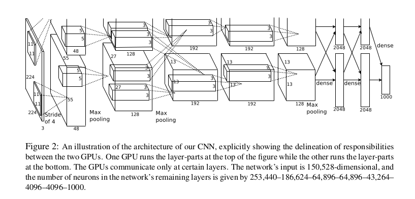
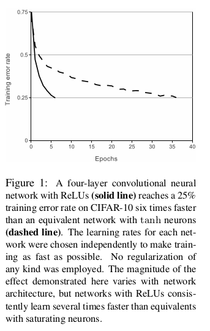
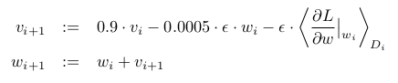
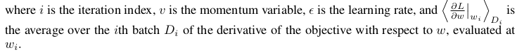

# Convolutional Neural Network
> by Yuan, Yiming Harry


## Architecture

### Models


From [Alex et al](https://papers.nips.cc/paper/4824-imagenet-classification-with-deep-convolutional-neural-networks.pdf) (ImageNet Classification with Deep Convolutional Neural Networks)


GoogleNet Model

### Neuron activation function


Rectified linear unit (ReLU) function

The rectifier is, as of 2015, the most popular activation function for deep neural networks



From Alex et al

### Backpropagation
To update the weights and bias during the training. This is important in the unsupervised training procedure.




## Inception (coding in Tensorflow)

The model is defined in `tensorflow/contrib/slim/python/slim/nets/inception_v3.py`
```python
with variable_scope.variable_scope(scope, 'InceptionV3', [inputs]):
  with arg_scope(
      [layers.conv2d, layers_lib.max_pool2d, layers_lib.avg_pool2d],
      stride=1,
      padding='VALID'):
    # 299 x 299 x 3
    end_point = 'Conv2d_1a_3x3'
    net = layers.conv2d(inputs, depth(32), [3, 3], stride=2, scope=end_point)
    end_points[end_point] = net
    if end_point == final_endpoint:
      return net, end_points
    # 149 x 149 x 32
    end_point = 'Conv2d_2a_3x3'
    net = layers.conv2d(net, depth(32), [3, 3], scope=end_point)
    end_points[end_point] = net
    if end_point == final_endpoint:
      return net, end_points
...
```

During the training, the updates action are packed in the `train_op`. From `inception_train.py`,
```python
# Retain the Batch Normalization updates operations only from the
# final tower. Ideally, we should grab the updates from all towers
# but these stats accumulate extremely fast so we can ignore the
# other stats from the other towers without significant detriment.
batchnorm_updates = tf.get_collection(slim.ops.UPDATE_OPS_COLLECTION,
                                      scope)
```
...
```python
# Group all updates to into a single train op.
batchnorm_updates_op = tf.group(*batchnorm_updates)
train_op = tf.group(apply_gradient_op, variables_averages_op,
                    batchnorm_updates_op)
```
