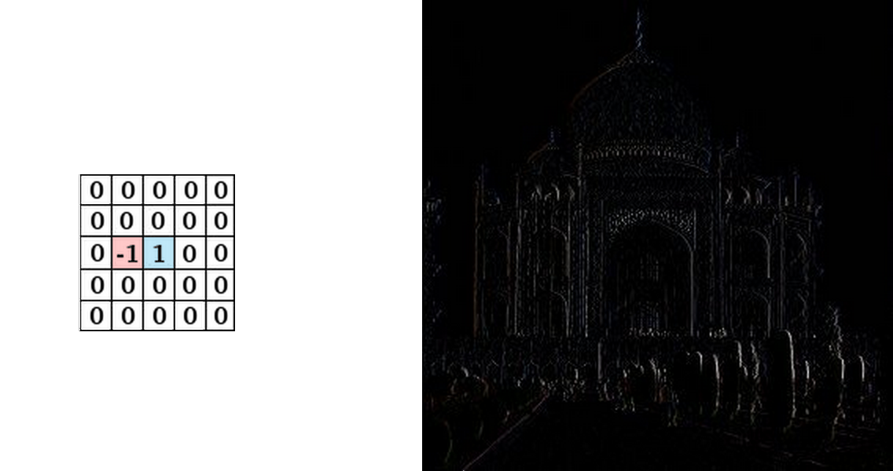
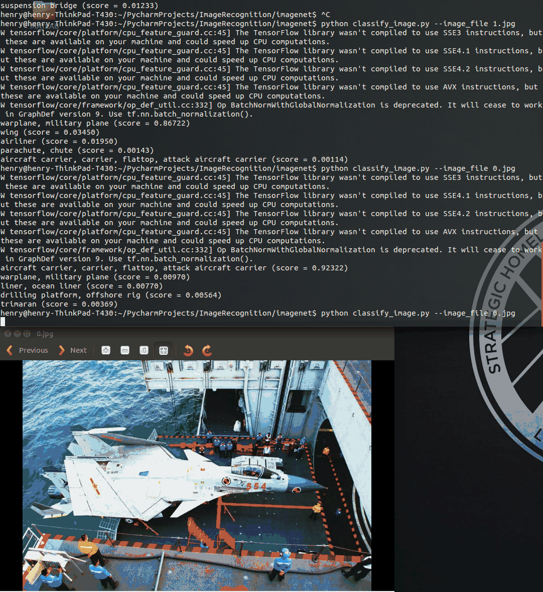
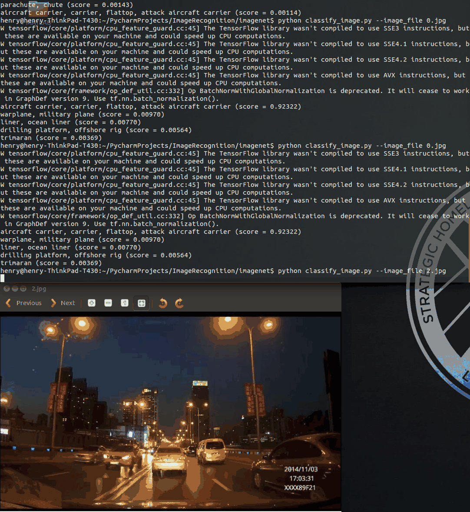

# Image Recognition 
> by Yuan, Yiming Harry

## Understanding Convolution
http://mathworld.wolfram.com/Convolution.html


One common application of this is image processing. We can think of images as two-dimensional functions. Many important image transformations are convolutions where you convolve the image function with a very small, local function called a “kernel.”


From [River Trail Documentation](http://intellabs.github.io/RiverTrail/tutorial/)


We can detect edges by taking the values −1−1 and 11 on two adjacent pixels, and zero everywhere else. That is, we subtract two adjacent pixels. When side by side pixels are similar, this is gives us approximately zero. On edges, however, adjacent pixels are very different in the direction perpendicular to the edge.



From [Gimp Documentation](https://docs.gimp.org/en/plug-in-convmatrix.html)

## Convolutional neural networks

http://colah.github.io/posts/2014-07-Conv-Nets-Modular/

## imagenet
### Usage with Python API
`classify_image.py` downloads the trained model from `tensorflow.org` when the program is run for the first time. 

Load `graph()` from the saved model

```python
def create_graph():
  """Creates a graph from saved GraphDef file and returns a saver."""
  # Creates graph from saved graph_def.pb.
  with tf.gfile.FastGFile(os.path.join(
      FLAGS.model_dir, 'classify_image_graph_def.pb'), 'rb') as f:
    graph_def = tf.GraphDef()
    graph_def.ParseFromString(f.read())
    _ = tf.import_graph_def(graph_def, name='')
```

Run prediction:

```python
# Creates graph from saved GraphDef.
  create_graph()

with tf.Session() as sess:
    # Some useful tensors:
    # 'softmax:0': A tensor containing the normalized prediction across
    #   1000 labels.
    # 'pool_3:0': A tensor containing the next-to-last layer containing 2048
    #   float description of the image.
    # 'DecodeJpeg/contents:0': A tensor containing a string providing JPEG
    #   encoding of the image.
    # Runs the softmax tensor by feeding the image_data as input to the graph.
    softmax_tensor = sess.graph.get_tensor_by_name('softmax:0')
    predictions = sess.run(softmax_tensor,
                           {'DecodeJpeg/contents:0': image_data})
    predictions = np.squeeze(predictions)

    # Creates node ID --> English string lookup.
    node_lookup = NodeLookup()

    top_k = predictions.argsort()[-FLAGS.num_top_predictions:][::-1]
    for node_id in top_k:
      human_string = node_lookup.id_to_string(node_id)
      score = predictions[node_id]
      print('%s (score = %.5f)' % (human_string, score))
```

### Example 1


```
henry@henry-ThinkPad-T430:~/PycharmProjects/ImageRecognition/imagenet$ python classify_image.py --image_file 0.jpg
W tensorflow/core/platform/cpu_feature_guard.cc:45] The TensorFlow library wasn't compiled to use SSE3 instructions, but these are available on your machine and could speed up CPU computations.
W tensorflow/core/platform/cpu_feature_guard.cc:45] The TensorFlow library wasn't compiled to use SSE4.1 instructions, but these are available on your machine and could speed up CPU computations.
W tensorflow/core/platform/cpu_feature_guard.cc:45] The TensorFlow library wasn't compiled to use SSE4.2 instructions, but these are available on your machine and could speed up CPU computations.
W tensorflow/core/platform/cpu_feature_guard.cc:45] The TensorFlow library wasn't compiled to use AVX instructions, but these are available on your machine and could speed up CPU computations.
W tensorflow/core/framework/op_def_util.cc:332] Op BatchNormWithGlobalNormalization is deprecated. It will cease to work in GraphDef version 9. Use tf.nn.batch_normalization().
aircraft carrier, carrier, flattop, attack aircraft carrier (score = 0.92322)
warplane, military plane (score = 0.00970)
liner, ocean liner (score = 0.00770)
drilling platform, offshore rig (score = 0.00564)
trimaran (score = 0.00369)
```


### Example 2


```
henry@henry-ThinkPad-T430:~/PycharmProjects/ImageRecognition/imagenet$ python classify_image.py --image_file 2.jpg
W tensorflow/core/platform/cpu_feature_guard.cc:45] The TensorFlow library wasn't compiled to use SSE3 instructions, but these are available on your machine and could speed up CPU computations.
W tensorflow/core/platform/cpu_feature_guard.cc:45] The TensorFlow library wasn't compiled to use SSE4.1 instructions, but these are available on your machine and could speed up CPU computations.
W tensorflow/core/platform/cpu_feature_guard.cc:45] The TensorFlow library wasn't compiled to use SSE4.2 instructions, but these are available on your machine and could speed up CPU computations.
W tensorflow/core/platform/cpu_feature_guard.cc:45] The TensorFlow library wasn't compiled to use AVX instructions, but these are available on your machine and could speed up CPU computations.
W tensorflow/core/framework/op_def_util.cc:332] Op BatchNormWithGlobalNormalization is deprecated. It will cease to work in GraphDef version 9. Use tf.nn.batch_normalization().
cab, hack, taxi, taxicab (score = 0.40581)
traffic light, traffic signal, stoplight (score = 0.23709)
obelisk (score = 0.03999)
fountain (score = 0.03717)
suspension bridge (score = 0.01233)
```

### Reference
[1]. Tensorflow Image Recognition Tutorials (https://www.tensorflow.org/tutorials/image_recognition)

[2]. Understanding Convolutions (http://colah.github.io/posts/2014-07-Understanding-Convolutions/)

[3]. Convolution Matrix - Gimp (https://docs.gimp.org/en/plug-in-convmatrix.html)

[4]. Conv Nets (http://colah.github.io/posts/2014-07-Conv-Nets-Modular/)

[4]. How to Build a Simple Image Recognition System with TensorFlow (http://www.wolfib.com/Image-Recognition-Intro-Part-1/)
